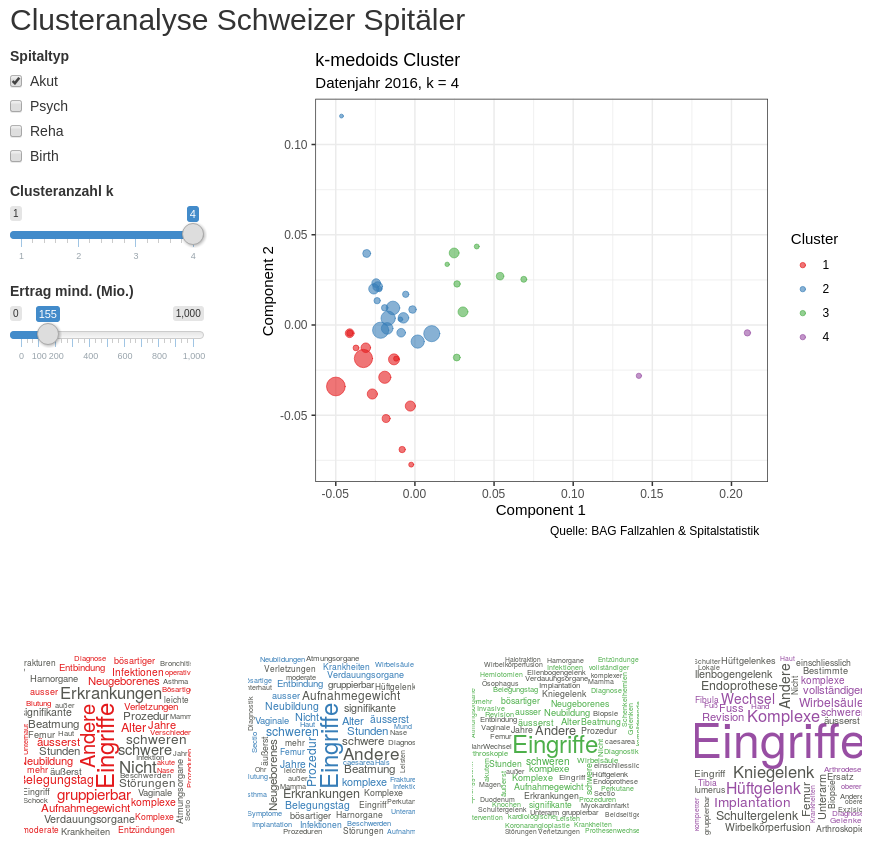

# Swiss Hospitals Classification

A simple R Shiny app to classify Swiss hospitals according to their DRG positions using clustering and wordclouds.

## Data

We use data from the Swiss Federal Office of Public Health (BAG), i.e. data from the [*DRG Fallzahlensuche*](http://www.drg-fallzahlsuche.admin.ch/de/systems/8?codes=&hospitals=&activeTab=&hospitalSearch=). We have a script to scrape the download, see `scrape_data.R`, but it might be preferable to just shoot them an email (*Öffentlichkeitsprinzip*).

Also we use the [Key figures for Swiss hospitals](https://www.bag.admin.ch/bag/de/home/zahlen-und-statistiken/zahlen-fakten-zu-spitaelern/kennzahlen-der-schweizer-spitaeler.html), `wget http://www.bag-anw.admin.ch/2016_taglab/2016_spitalstatistik/data/download/kzp16_daten.xlsx`.

## Notes

I've also written a [blog post](https://www.econovo.ch/de/2019/03/18/fallzahlen-cluster/), see on my company website [www.econovo.ch](https://www.econovo.ch).